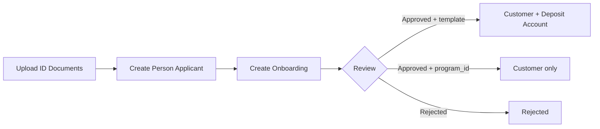
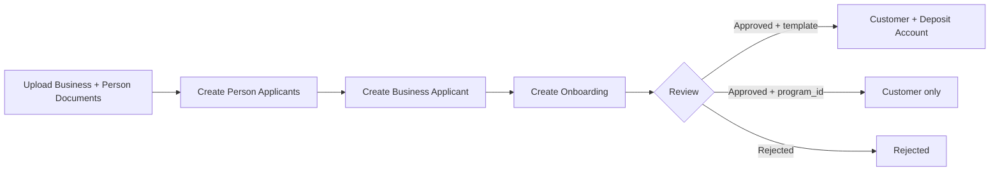

> For a complete page index, fetch https://docs.erebor.bank/llms.txt

# Onboarding

Onboarding turns applicants into approved customers. You upload documents, create an applicant, and submit an Onboarding for review. On approval, we create a Customer — and, depending on how you submit, optionally open the first Deposit Account at the same time.

Two paths:

* **[Person onboarding](/onboarding/person-onboarding)** — for individuals
* **[Business onboarding](/onboarding/business-onboarding)** — for companies, including control persons and beneficial owners

## Two onboarding modes

When you create an Onboarding you must provide **at least one** of these fields:

| Field                         | What it does on approval                                                                                                                                        |
| ----------------------------- | --------------------------------------------------------------------------------------------------------------------------------------------------------------- |
| `deposit_account_template_id` | Creates the Customer **and** opens an initial Deposit Account from the template. Turnkey approve→account flow.                                                  |
| `program_id`                  | Creates only the Customer in that program. No initial Deposit Account. Open accounts later via `POST /deposit_accounts` when the customer is ready to transact. |

Both modes produce the same `Customer` object. The difference is whether an initial account is opened automatically.

You may also supply **both** fields together — this is equivalent to providing only `deposit_account_template_id`. The supplied `program_id` is treated as a confirming assertion against the template's program; a mismatch returns `400`.

## Person onboarding flow



Three steps: upload a government-issued ID, create a Person Applicant with their details, and submit the Onboarding for review.

See [Person Onboarding](/onboarding/person-onboarding) for the full walkthrough.

## Business onboarding flow



Four steps: upload documents for the business and each associated person, create Person Applicants for those people, create the Business Applicant linking them together, and submit the Onboarding.

See [Business Onboarding](/onboarding/business-onboarding) for the full walkthrough.

## Onboarding statuses

| Status         | What it means                                                                                                                |
| -------------- | ---------------------------------------------------------------------------------------------------------------------------- |
| `SUBMITTED`    | We've received the Onboarding and it's queued for review.                                                                    |
| `UNDER_REVIEW` | KYC and compliance review is in progress.                                                                                    |
| `APPROVED`     | Review complete. The Customer is created. The Deposit Account is also created if `deposit_account_template_id` was supplied. |
| `REJECTED`     | The application was denied.                                                                                                  |

## What happens on approval

When an Onboarding reaches `APPROVED`:

* A **Customer** is always created — accessible via `customer_id` on the Onboarding. The `ONBOARDING.APPROVED` event fires.
* A **Deposit Account** is created **only when** the Onboarding was submitted with `deposit_account_template_id`. Accessible via `deposit_account_id` on the Onboarding. The `DEPOSIT_ACCOUNT.PENDING` (and subsequently `DEPOSIT_ACCOUNT.OPEN`) events fire only in this case.
* If you used `program_id`, no account is opened. Open one (or many) later by calling `POST /deposit_accounts` for the customer.

Retrieve the Onboarding to see what was created:

```bash
curl -X GET "https://api.erebor.bank/onboardings/onb_01kasd1tthf1ns1pjn1kncctwd" \
  -H "Authorization: test_1a2b3c4d5e6f7g8h9i0j"
```

```json
{
  "id": "onb_01kasd1tthf1ns1pjn1kncctwd",
  "type": "ONBOARDING",
  "status": "APPROVED",
  "applicant_type": "PERSON",
  "person_applicant_id": "prsn_app_01kasd1tthf1ns1pjn1kncctwd",
  "business_applicant_id": null,
  "deposit_account_template_id": "dep_acct_tmpl_01kasd1tthf1ns1pjn1kncctwd",
  "customer_id": "cust_01kasd1tthf1ns1pjn1kncctwd",
  "deposit_account_id": "dep_acct_01kasd1tthf1ns1pjn1kncctwd",
  "disclosures": {
    "disclosures_signed_externally": true
  },
  "program_id": "prgrm_01kasd1tthf1ns1pjn1kncctwd",
  "url": "https://api.erebor.bank/onboardings/onb_01kasd1tthf1ns1pjn1kncctwd",
  "created_at": "2025-01-15T09:30:00Z",
  "updated_at": "2025-01-15T10:15:00Z",
  "archived_at": null
}
```

On a program-only Onboarding, `deposit_account_template_id` and `deposit_account_id` will be `null`.

## Testing in the sandbox

In the sandbox you can force an Onboarding to `REJECTED`, `UNDER_REVIEW`, or `APPROVED` using the `Erebor-Simulation-Scenario` header on `POST /onboardings`. See [Simulation scenarios](/api-reference/simulation/simulation-scenarios/onboarding) in the API reference.

## Prerequisites

Programs and deposit account templates are configured by Erebor and represent the top-level context for your customers and accounts.

* Use `deposit_account_template_id` when you want an account opened automatically on approval. The program is derived from the template.
* Use `program_id` when you want to KYC ahead of time and open accounts later (for example, partners who want to delay account opening until activation).

List your available programs and templates:

```bash
curl -X GET "https://api.erebor.bank/programs" \
  -H "Authorization: test_1a2b3c4d5e6f7g8h9i0j"
```

```bash
curl -X GET "https://api.erebor.bank/deposit_account_templates" \
  -H "Authorization: test_1a2b3c4d5e6f7g8h9i0j"
```

## Next steps

* [Person Onboarding](/onboarding/person-onboarding) — Step-by-step guide for onboarding individuals
* [Business Onboarding](/onboarding/business-onboarding) — Step-by-step guide for onboarding companies
* [Account management](/api-reference/accounts/deposit-accounts/list-deposit-accounts) — Manage deposit accounts, account numbers, and blockchain addresses
* [Supported events](/api-reference/events/supported-events) — Subscribe to Onboarding and account status change events