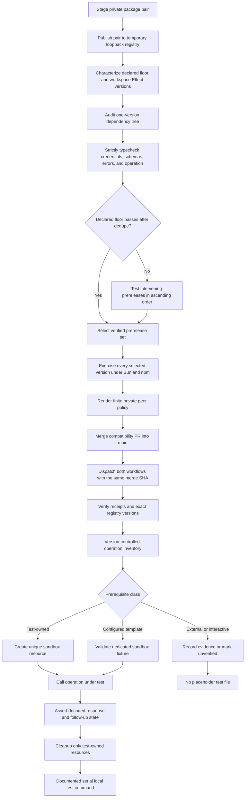

# Persona Live API Coverage and Effect Compatibility - Plan

## Goal Capsule

- **Objective:** Replace Persona's misleading auth-only operation placeholders with meaningful local sandbox coverage, and make the private Distilled packages advertise and install an Effect version contract that matches strict downstream TypeScript behavior.
- **Authority:** The user's requirement for meaningful live API coverage, then repository testing conventions in `AGENTS.md`, then Persona's generated OpenAPI contract.
- **Execution profile:** The expected path is two sequential pull requests. The first diagnoses and fixes Effect compatibility, merges to `main`, and publishes verified core/Persona and core/Erebor package pairs; only then does a fresh branch from updated `main` implement the Persona sandbox coverage plan in a second PR. If post-merge release verification exposes a source or manifest defect, land the smallest compatibility-only corrective PR and repeat the release gate before creating the Persona branch.
- **Stop conditions:** Stop before the Persona phase if either private publication, tag movement, matching core/provider dependency verification, or strict registry-consumer smoke testing is incomplete. During the Persona phase, stop and surface evidence when a proposed happy path needs an unavailable entitlement, dashboard-only fixture, second organization, browser interaction, or irreversible action against data the test did not create.
- **Tail ownership:** The Effect phase is incomplete until its PR is merged and new private core/Persona and core/Erebor pairs are published and smoke-tested from the registry with receipts tied to the compatibility merge. The Persona phase then owns local live-test execution, cleanup/recovery, and the reviewed inventory in its own PR; CI test wiring and broader shared test-generation workflow changes remain out of scope.

---

## Product Contract

### Summary

Persona's package tests should provide evidence that the generated client works against Persona's sandbox, not merely that a common invalid credential is rejected. The suite will organize live scenarios around resource lifecycles, create its own test data, verify mutations through subsequent API reads, and remove operation files that cannot prove meaningful behavior. Before that work begins, a standalone compatibility PR will ensure the private Persona, Erebor, and core artifacts expose one evidence-backed Effect contract, merge it, and publish replacement package versions for the currently blocked downstream consumer.

### Problem Frame

The package contains 200 operation test files. Only `createAnAccount.test.ts`, `listAllAccounts.test.ts`, and `searchAccounts.test.ts` make authenticated sandbox calls; the other 197 send a fabricated API key and assert `Unauthorized`. Those tests are not transport mocks, but they are effectively one duplicated client-level auth test: Persona rejects them before the operation-specific path, request body, successful response schema, or lifecycle behavior can be validated.

The generic test-generation workflow asked for a happy path and an error path, but it had no deterministic quality gate. Because auth-only tests run without `PERSONA_API_KEY`, the full local suite can pass while proving almost nothing about operation-specific request and response behavior.

The private package manifests currently preserve `effect` as both a direct dependency and a peer dependency for Persona and Erebor. Their peer range starts at `4.0.0-beta.97`, while the workspace lockfile and emitted declarations are built with beta.98; the existing install smoke tests verify only that JavaScript imports succeed. A downstream project using beta.97 reports incompatible credentials, schemas, errors, and operation types, and aligning it to beta.98 removes those failures. The leading hypothesis is a nested beta.98 Effect instance beside the consumer's beta.97, but the plan must distinguish that from a genuinely unsupported peer floor or an emitted-declaration regression before choosing the fix.

### Requirements

**Live behavior**

- R1. Every retained Persona API test must make at least one authenticated call to the real sandbox and assert operation-specific output or state.
- R2. Mutating scenarios must create resources owned by that test run, register every returned ID before assertions, verify the mutation through the response or a follow-up retrieve/list call, and clean up in dependency-aware LIFO order.
- R3. Successful scenarios must use generated input types without `as any`, so request-schema regressions fail at compile time as well as runtime.
- R4. Error coverage must target meaningful operation behavior such as malformed input, missing owned-style IDs, conflict, or invalid state; invalid credentials are tested once at the client boundary rather than once per operation.

**Coverage integrity**

- R5. Every generated Persona operation must be classified as live-covered, fixture-dependent, environment/entitlement-dependent, infeasible for automated sandbox testing, or unverified. Every non-live entry must record its evidence source, observed error or documented prerequisite, last-verified date, and the condition that would promote it; ambiguous sandbox failures remain unverified rather than becoming unsupported conclusions.
- R6. An operation without a feasible happy path must have no green placeholder test that implies coverage.
- R7. The Persona coverage PR must prioritize fully owned resource families and the inquiry contract that motivated the recent Persona schema work.

**Reliability and local execution**

- R8. Test resource names and idempotency keys must include the shared `testRunId`, and cleanup must never target pre-existing sandbox data or suppress an unexpected cleanup failure.
- R9. Persona live tests run manually on developer machines with the existing shared sandbox `PERSONA_API_KEY`, single-worker execution, and bounded polling appropriate to Persona rate limits.
- R10. Missing mandatory credentials or fixtures must produce a clear failure; tests may not silently return, swallow an error, or pass on an empty prerequisite.

**Security and data handling**

- R11. Live tests must use reserved synthetic values only and must never emit credentials, returned secret values, PII-like payloads, or raw API response, API-log, or event bodies into local test output.
- R12. The shared sandbox key must be loaded only from the local environment and must never be embedded in source, snapshots, fixtures, or logs; rotating or replacing that credential is not part of the Persona coverage PR.
- R21. Compatibility and registry-smoke subprocesses must receive an allowlisted environment: unrelated sandbox and developer credentials are removed, a GitHub Packages token is available only to the authenticated install or metadata-fetch operation that needs it, and authenticated registry access is pinned to `https://npm.pkg.github.com`.

**Published Effect compatibility**

- R13. A strict temporary consumer using the staged private core plus Persona or Erebor package must reproduce the beta.97/beta.98 behavior with `skipLibCheck: false` and record the installed Effect dependency tree before any manifest fix is selected.
- R14. Published SDKs that expose Effect types must resolve those types from the consumer's single peer instance; the staged Persona and Erebor manifests may not also ship Effect as a direct runtime dependency.
- R15. Every Effect prerelease admitted by the private staged peer range must pass representative credentials, schema, error, and operation typechecks against the actual staged artifacts. Preserve beta.97 only if it passes after deduplication; otherwise raise the floor to the first passing published prerelease, and do not advertise untested later prereleases or stable Effect 4 versions.
- R16. Local package smoke coverage must typecheck and execute a representative import from the staged package, not stop after a JavaScript module import succeeds.
- R17. The committed private Effect compatibility policy is the publication source for the staged core, Persona, and Erebor peer ranges and enumerates every admitted prerelease. Private package preparation must reject an unresolved catalog specifier, duplicate direct-plus-peer Effect declarations, or a workspace build version absent from that policy; a lockfile Effect update therefore requires fresh local compatibility evidence and a policy update.

**Delivery and release order**

- R18. Effect diagnosis and correction must ship in its own first PR; no Persona live-test implementation begins on that branch or before the compatibility PR is merged into `main`.
- R19. After the compatibility PR merges, publish and verify a new private core/Persona pair and a new private core/Erebor pair from that merged revision before declaring the first phase complete; the two core package versions may differ, but both must contain the same merged core source.
- R20. The Persona coverage work starts from a fresh branch after fetching the post-publication `main` state and ships as a separate second PR.
- R22. Both private publication workflows must check out the same required compatibility merge SHA, verify that commit is reachable from `main`, publish immutable packed artifacts, and emit release receipts that bind the workflow run, source SHA, package versions, dist-tags, and registry integrity values.

### Acceptance Examples

- AE1. Given a unique account reference and synthetic standard field, when the suite creates, retrieves, updates, searches, tags, and redacts the account, each operation returns the expected resource and cleanup runs even after an assertion failure.
- AE2. Given the dedicated configured sandbox inquiry template with its expected custom field, when the suite creates an inquiry with that field and retrieves it, the custom field survives the generated output decode.
- AE3. Given a created string list and list item, when the suite retrieves and archives each resource, the returned IDs and terminal statuses match the created resources.
- AE4. Given a Persona package change, when a developer runs the documented local live-test command, a broken successful response schema fails the suite rather than passing on 401-only coverage.
- AE5. Given an endpoint that requires a second organization or browser-completed verification, when the coverage inventory is reviewed, it is marked with that prerequisite and has no auth-only test file.
- AE6. Given staged private packages and a consumer pinned to the advertised minimum Effect version, when the strict consumer imports credentials, schemas, typed errors, and an operation, TypeScript succeeds and the dependency tree contains one Effect version.
- AE7. Given a future Effect lockfile update without a corresponding compatibility decision, when private packages are prepared locally, the compatibility check fails before a package can be published with an unproven peer claim.
- AE8. Given the compatibility PR has merged, when the release gate completes, the registry exposes a new core/Persona pair and a new core/Erebor pair whose manifests and strict consumer behavior match the merged revision; only then may the Persona coverage branch be created.
- AE9. Given the same compatibility merge SHA is supplied to both private publication workflows, when their releases complete, each receipt and registry artifact identifies that SHA and the exact matching core/provider versions, and a foreign registry URL cannot receive the GitHub Packages token.

### Scope Boundaries

#### In scope across the two PRs

- Shared Persona live-test helpers, resource ownership, cleanup, dedicated fixture validation, and bounded execution.
- A client-level invalid-credential test, an account lifecycle suite, a dedicated inquiry create/retrieve custom-field regression, and one representative string list/list-item lifecycle.
- A Persona input-spec patch and regeneration that preserves named request fields while representing template-defined additional values as schema-valued JSON, without `as any` or provider logic in the shared generator.
- A complete, reviewable coverage inventory for all 200 operations.
- Deletion of the 197 auth-only placeholders and consolidation of the three useful account tests into the resource-family convention.
- A documented local live-test command using the existing shared sandbox credential from `PERSONA_API_KEY`.
- Diagnosis and correction of Effect dependency topology and peer-range accuracy for the fork's private core, Persona, and Erebor packages.
- Strict local staged-package consumer coverage for every prerelease admitted by the private publication policy, including the workspace-resolved Effect version, under Bun and npm resolution.
- A publish-time manifest policy enforced by the existing private package preparation scripts, plus the minimum existing-workflow changes needed to pin an immutable source SHA and emit verifiable release receipts.
- Merge and registry publication of the Effect fix before the Persona test-suite PR begins, including new private core/Persona and core/Erebor package pairs.

#### Deferred to Follow-Up Work

- Generalizing the proven Persona approach into `.smithers/workflows/sdk-generate-tests.tsx` or `scripts/generate-tests.ts`. That shared workflow should be changed only after the provider-specific lifecycle pattern and quality signals are concrete enough to make an upstream-friendly, provider-agnostic rule.
- Transactions, webhook actions, API-key creation/cloning, the remaining list variants, broad inquiry state transitions, and inquiry sessions. These should follow in inventory-driven PRs after the first lifecycles prove the harness and sandbox safeguards.
- Live suites for dashboard-seeded cases, workflows, graph queries, specialized reports, uploaded documents, and verification subtypes when stable fixture IDs and entitlements are available.
- Multi-organization Connect, OAuth authorization-code exchange, Relay, Privacy Pass, and browser-driven inquiry completion.
- General compatibility guarantees for every historical Effect 4 beta or every public upstream SDK; the matrix covers the private packages and the versions they advertise now.

#### Out of scope

- Mock servers, recorded HTTP fixtures, or schema-only tests presented as Persona API coverage.
- New CI test workflows, protected environments, CI secrets, credential rotation, broader publication redesign, and making Persona tests a merge gate. Minimal integrity changes to the two existing private publication workflows are in scope for the compatibility PR.
- Pinning or modifying the downstream repository, suppressing its TypeScript errors, or relying on `skipLibCheck` to hide incompatible declarations.
- Combining Effect compatibility and Persona live-test changes into one branch or one pull request.
- Hand edits to `packages/persona/src/operations/` or changes to core OpenAPI generation.
- Redacting, expiring, archiving, or mutating resources that are not provably owned by the current run or by an explicit recovery `testRunId`.
- Embedding the sandbox key or any created API-key value in source, logs, snapshots, or the coverage inventory.
- Treating the sandbox-wide Persona nuke script as per-test cleanup, interrupted-run recovery, or proof that a test cleaned up its own resources.

---

## Current Coverage Inventory

The OpenAPI document exposes 200 operations. The buckets below are a provisional setup-shape inventory, not evidence classifications or guaranteed implementation success. U1 records actual sandbox evidence and may mark an operation `unverified` when a failure has multiple plausible causes.

| Bucket | Operations | Families | Recommended treatment |
|---|---:|---|---|
| Potentially test-owned lifecycle | 86 | Accounts, API Keys, Transactions, Webhooks, Lists, List Items | Highest-priority census. Basic CRUD, tags, and terminal actions can own resources; relations, configured actions/types, API-key management, and two list-item families still require organization configuration or stronger secret safeguards. |
| Template or configured fixture | 55 | Inquiries, Inquiry Sessions, Cases, Case Templates, Reports, Workflows, Graph | Cover inquiry create/retrieve through a dedicated configured template whose field contract is validated. Add other families only when the sandbox exposes a stable prerequisite; otherwise record the exact fixture or entitlement needed. |
| Derived or read-only | 43 | API Logs, Account/Transaction Types, Devices, Documents, Events, Inquiry Templates, Importers, Rate Limits, User Audit Logs, Verifications | Prefer IDs and events created by a live lifecycle. For truly read-only resources, assert list/retrieve decoding against deterministic sandbox data; do not pass on an empty collection. |
| Partner or interactive protocol | 16 | Connect, OAuth, Relay | Keep out of the mandatory first suite unless the required second organization, redirect flow, or cryptographic/browser setup is supplied. |

The Persona coverage PR intentionally proves the testing model on a narrow slice: accounts, inquiry create/retrieve, one string list/list-item lifecycle, and a single client auth check. The inventory then orders later PRs without making this initial live, destructive diff carry every resource family's state machine and security risks at once.

---

## Planning Contract

### Key Technical Decisions

- KTD1. Organize Persona tests by resource family while keeping one test per operation or coherent state transition. Related operations may share owned fixture helpers, but a failure in one long mega-test must not prevent unrelated operation coverage from running.
- KTD2. Treat coverage as an evidence classification, not a file-count metric. A missing test with a precise prerequisite is more honest than a green 401 assertion that never reaches the endpoint behavior.
- KTD3. Keep one invalid-credential scenario at the Persona client boundary. Operation suites focus on successful decoding and operation-relevant `BadRequest`, `NotFound`, `Conflict`, or state errors.
- KTD4. Separate mandatory self-contained coverage from fixture-dependent coverage. The inquiry regression uses a dedicated sandbox template identifier whose field contract is validated during setup; arbitrary active-template discovery is too unstable for a repeatable local suite.
- KTD5. Run Persona live tests locally and serially. (session-settled: user-directed — chosen over CI execution: Persona tests are for deliberate local verification, not merge gating.) Follow the Axiom rate-limit precedent by using a single Vitest worker; do not add Persona test jobs or CI gating. This does not prohibit the narrow private-publication workflow integrity changes in KTD20.
- KTD6. Do not change the shared Smithers test generator in the Persona coverage PR. Instead, add a normal Persona Vitest inventory test that rejects unclassified operations and auth-only placeholder coverage, preventing regeneration from silently restoring the current failure mode without introducing a second test framework.
- KTD7. Test inputs stay type checked. Removing `as any` is part of the value proposition because the tests should detect incorrect generated request contracts before making HTTP calls.
- KTD8. Patch Persona's request specification when its `allOf`/`additionalProperties: true` shape loses tenant-defined inquiry fields, then regenerate through the normal Persona pipeline. Model request values as recursive JSON because the vendor contract says their schema is template-defined; keep the separately verified strict typed union for response field envelopes. Do not infer additional request variants from response observations, weaken the response contract, or hand-edit generated operations.
- KTD9. Continue using the existing shared sandbox credential from the local environment. (session-settled: user-directed — chosen over rotating or provisioning a separate credential: credential lifecycle work is outside this test-suite PR.) Use only reserved synthetic identity data, and defer secret-bearing API-key and webhook operations until failure paths cannot expose returned secrets through parse errors or test output.
- KTD10. Register a deterministic ownership locator before every create call. If Persona commits a mutation but generated output decoding fails before an ID is returned, finalization reconciles only exact current-run matches, captures their IDs, and performs normal LIFO cleanup.
- KTD11. Sanitize live-test failures at the Persona test boundary. Preserve the error tag and structural decode path, but never allow raw response bodies, schema causes containing values, session tokens, or other secret-bearing fields to reach Vitest output.
- KTD12. Treat Effect as a peer-only runtime/type dependency for SDK packages whose public API exposes Effect identities. Persona and Erebor must not publish a second direct Effect dependency alongside their peer declaration; core already follows the intended peer-only shape.
- KTD13. Diagnose dependency topology before raising the peer floor. The first proof compares staged artifacts under beta.97 and beta.98 with strict library checking and an installed-version audit; a lower-bound change is justified only if one Effect instance at beta.97 remains incompatible.
- KTD14. Derive candidate compatibility cases from the current published contract and workspace resolution, not a hard-coded downstream workaround. The characterization starts with the declared floor and workspace build version; if the floor fails, it enumerates published Effect prereleases between them in ascending order. The post-fix private publication policy then admits only concrete prereleases that passed, and the local matrix exercises every admitted version.
- KTD15. Keep the fork fix narrow and publish-facing. Reuse the existing Persona and Erebor staging/smoke paths, add shared validation only where it prevents those paths from drifting, and do not redesign upstream package publication or change Effect-facing application APIs unless the compatibility fixture proves that necessary.
- KTD16. Deliver Effect compatibility first in an independent PR. (session-settled: user-directed — chosen over a combined PR: another repository is blocked on corrected packages and should not wait for the broader Persona test work.) The Persona units remain untouched until the compatibility PR is merged and released.
- KTD17. Treat publication as a blocking delivery gate, not a follow-up note. (session-settled: user-directed — chosen over stopping after merge: the downstream consumer needs installable registry artifacts.) Publish and verify private core/Persona and core/Erebor pairs from the merged compatibility revision before creating the Persona coverage branch.
- KTD18. Reproduce staged-package topology through a temporary loopback npm registry. The prepared provider's exact private-core alias must remain unchanged, so direct tarball or workspace-path rewrites cannot create a falsely passing consumer; the registry binds only to loopback, uses a generated version and temporary storage, and receives no GitHub Packages token.
- KTD19. Keep the evidence-backed peer contract private-package-specific. The staged private core, Persona, and Erebor manifests use the finite set of verified prereleases from `scripts/effect-compatibility-versions.json`; do not raise the shared root catalog or advertise untested prereleases without a workspace-wide compatibility matrix for the other SDK consumers.
- KTD20. Pin release provenance rather than relying on moving `main`. Both existing private publication workflows accept the same required source SHA, verify it is reachable from `main`, publish packed tarballs, and emit machine-readable receipts; this narrow workflow hardening does not add Persona tests to CI or redesign package publication.

### High-Level Technical Design

### Execution Direction

Start the Effect track with a failing staged-consumer characterization at beta.97 and a passing control at beta.98. Record the resolved dependency tree before changing manifests, remove the duplicate dependency path first, and only then decide whether the peer lower bound itself is inaccurate.

Merge and publish the Effect correction before starting any Persona coverage implementation. Once the exact core/Persona and core/Erebor registry pairs pass provenance checks and strict installation smoke tests, fetch `main`, create a fresh Persona branch, and begin with the read-only sandbox capability census. Build the retained Persona scenarios in this order: client auth boundary, accounts, inquiry custom-field create/retrieve, then a string list/list-item lifecycle.

### Phased Delivery

1. **Compatibility PR:** U6 characterizes the failure and U7 corrects the package contract. This branch contains no U1-U5 Persona coverage work.
2. **Merge and release gate:** U8 merges the compatibility PR, returns to updated `main`, publishes private core/Persona and core/Erebor pairs from that merged revision, and verifies the exact published versions. Retryable workflow or registry-propagation failures rerun U8. A source or manifest defect requires the smallest compatibility-only corrective PR to merge before U8 repeats; neither path permits Persona work to start.
3. **Persona coverage PR:** After U8 completes, create a new branch from the updated `main` and execute U1-U5. The Persona PR contains no unfinished compatibility or release work.

### Local Prerequisites

- The developer running the suite supplies the existing shared key through `PERSONA_API_KEY`.
- The dedicated inquiry fixture is configured through `PERSONA_INQUIRY_TEMPLATE_ID` and `PERSONA_INQUIRY_FIELD_NAME`; setup verifies the template is active and the field's declared value type matches the test scenario before creating data.
- Missing or drifted configuration fails before mutation with an actionable message. The suite never silently skips a mandatory live scenario.
- No new GitHub Environment, CI test job, or credential rotation is required. The compatibility PR makes only the source-pinning and release-receipt changes needed in the two existing private-package publication workflows.

### Research Anchors

- `scripts/generate-tests.ts` and `.smithers/workflows/sdk-generate-tests.tsx` show the intended happy-plus-error workflow and the missing deterministic enforcement.
- `packages/persona/test/setup.ts` already supplies real credentials, invalid credentials, HTTP transport, and a shared run ID, but most generated tests use only the invalid layer.
- `packages/persona/scripts/nuke.ts` identifies Persona resource terminal actions and distinguishes read-only resources from archivable, expirable, or redactable resources.
- `packages/cloudflare/test/r2.test.ts`, `packages/planetscale/tests/databases.test.ts`, and `packages/erebor/test/createWebhook.test.ts` demonstrate unique resources, full lifecycles, follow-up verification, and unconditional cleanup.
- `package.json` advertises Effect from beta.97 while `bun.lock` resolves Effect and the related platform packages to beta.98.
- `packages/core/package.json` declares Effect only as a peer, while `packages/persona/package.json` and `packages/erebor/package.json` declare it as both a dependency and peer.
- `scripts/prepare-github-persona-packages.ts` and `scripts/prepare-github-erebor-packages.ts` preserve both dependency maps in staged manifests; the corresponding smoke scripts currently check only runtime import success.

---

## Implementation Units

### U6. Reproduce and classify the published Effect incompatibility

- **Goal:** Turn the downstream beta.97/beta.98 report into a deterministic staged-package compatibility matrix that identifies dependency duplication separately from declaration-level incompatibility.
- **Requirements:** R13, R15-R16, R21; AE6; KTD13-KTD14, KTD18.
- **Dependencies:** None.
- **Files:** `scripts/check-effect-compatibility.ts`, `scripts/check-effect-compatibility.test.ts`, `scripts/effect-compatibility-versions.json`, `scripts/fixtures/effect-consumer/tsconfig.json`, `scripts/fixtures/effect-consumer/persona.ts`, `scripts/fixtures/effect-consumer/erebor.ts`, `scripts/smoke-github-persona-install.ts`, `scripts/smoke-github-erebor-install.ts`, `package.json`, `bun.lock`.
- **Approach:** Extend the existing private-package smoke concept from runtime import to a temporary strict TypeScript consumer of the staged core/provider pair. Add Verdaccio as a pinned root development dependency, launch it on a random loopback port with temporary storage, publish both prepared packages under one generated version, and keep the provider's exact `npm:@hourglass-financial/distilled-core@<version>` dependency intact so resolution matches the real private package topology. Parameterize the runner by provider, package manager, and Effect version, while pinning and reporting the workspace-resolved TypeScript compiler so Effect is the controlled variable. Characterization starts with the advertised lower bound and workspace-resolved build version; if the lower bound fails with one Effect instance and the versions are not adjacent, query the public Effect release list and test intervening prereleases in ascending order to find the first passing version. For each case, capture the dependency tree without dumping credentials and typecheck representative credentials/layer composition, a schema codec, a typed error, and an operation effect with `skipLibCheck: false`. The pre-fix characterization records and classifies multiple physical Effect versions instead of treating them as a harness failure; post-U7 verification requires exactly one. Classify failures as duplicate-version topology, single-version declaration incompatibility, unresolved catalog/package metadata, or runtime import failure. The staged path uses only the generated loopback registry and no registry credential. The published-artifact path accepts only `https://npm.pkg.github.com`; all child processes receive a minimal allowlisted environment with a temporary home, and the GitHub Packages token exists only for authenticated install or metadata-fetch children. The runner returns the concrete passing candidates; U7 alone updates the committed private compatibility policy, which is consumed by both preparers and the matrix rather than serving as an unused test log. Temporary registries, homes, npm configuration, consumers, and tokens are removed in finalization on success and failure unless an explicit non-secret diagnostic-retention flag is set. The initial beta.97 failure and beta.98 control are characterization evidence; this unit does not choose a peer-range change before the post-deduplication result exists.
- **Execution note:** Capture the failing beta.97 consumer before editing package manifests, then rerun the identical fixture after U7.
- **Patterns to follow:** `scripts/smoke-github-persona-install.ts` and `scripts/smoke-github-erebor-install.ts` for isolated consumers and registry-safe environment handling; `scripts/prepare-github-persona-packages.ts` for publish-equivalent staged artifacts.
- **Test scenarios:**
  - Stage the current private core and Persona packages, install them with consumer Effect beta.97, and report both the strict TypeScript diagnostics and every installed Effect version.
  - Repeat with beta.98 as the passing control using the same consumer source and compiler settings.
  - If the failing floor and workspace version are not adjacent, test every published intervening prerelease in ascending order and identify the first passing single-instance version.
  - Run the same lower-bound and workspace-version cases for Erebor so its identical manifest shape cannot drift independently.
  - Run the matrix with Bun and npm; both must report their resolved topology during characterization, and both must resolve one Effect instance after U7 before compatibility passes.
  - Resolve the provider's exact private-core alias through the temporary loopback registry; a workspace path or rewritten file dependency fails the harness-fidelity test.
  - Deliberately provide a staged manifest containing Effect in both `dependencies` and `peerDependencies`; the policy test identifies the duplicate before installation.
  - Deliberately make the consumer's Effect version disagree with the requested matrix case; the runner fails with a version-topology error rather than presenting TypeScript noise as the root cause.
  - Provide a foreign authenticated registry URL and confirm it is rejected before token resolution or `.npmrc` creation; the loopback staged registry remains credential-free.
  - Seed `PERSONA_API_KEY`, `EREBOR_API_KEY`, inquiry fixture values, and a canary developer secret in the parent process and confirm install, typecheck, and runtime children cannot read them.
  - Force installation and typecheck failures and confirm temporary registries, homes, consumers, and npm configuration are removed by default, diagnostic retention is explicit, and no registry token appears in output or retained files.
- **Verification:** The handoff's symptom is reproducible from staged artifacts, beta.97 and beta.98 results are classified by cause, and the fixture fails if it cannot prove which Effect version supplied the public types.

### U7. Make the private package Effect contract truthful and self-validating

- **Goal:** Remove duplicate Effect ownership, correct whichever compatibility mismatch U6 confirms, and prevent future private packages from advertising an untested compatibility floor.
- **Requirements:** R14-R18, R21-R22; AE6-AE7; KTD12-KTD16, KTD19-KTD20.
- **Dependencies:** U6.
- **Files:** `packages/persona/package.json`, `packages/erebor/package.json`, `package.json`, `bun.lock`, `scripts/prepare-github-persona-packages.ts`, `scripts/prepare-github-erebor-packages.ts`, `scripts/lib/effect-package-policy.ts`, `scripts/check-effect-compatibility.test.ts`, `scripts/effect-compatibility-versions.json`, `.github/workflows/publish-persona-private.yml`, `.github/workflows/publish-erebor-private.yml`, `HOURGLASS.md`.
- **Approach:** Remove Effect from the direct dependency maps of Persona and Erebor and retain it as the consumer-supplied peer, matching core's public-type topology. Make `scripts/effect-compatibility-versions.json` the private publication policy consumed by the compatibility runner and both package preparers. It contains only concrete prereleases proven by the post-deduplication matrix; Persona and Erebor source manifests use the corresponding finite peer union, while the preparers apply the same union to the staged private core and verify all three private manifests agree. Preparation rejects duplicate direct-plus-peer declarations, unresolved catalogs, an empty policy, an unverified manifest range, or a workspace-resolved build version absent from it. If beta.97 passes, retain it in the verified set; if it fails with a single instance, test intervening published prereleases and begin the set at the first passing version. Do not copy this private finite range into the shared root catalog without a separate workspace-wide matrix. Update the lockfile only for actual workspace resolution changes, and document the evidence-backed fork policy in `HOURGLASS.md`. Extend both existing private publication workflows with a required source-SHA input, verify that commit is reachable from `main`, check out exactly that SHA, pack the staged core/provider directories into immutable tarballs, publish those tarballs, and emit a machine-readable release receipt containing workflow/run identity, checked-out SHA, package names and versions, moved dist-tags, and registry integrity values. Keep the runtime import smoke after the typecheck so type compatibility does not replace executable-package validation.
- **Execution note:** Fix dependency topology first; change the peer floor only when the single-version beta.97 case remains red.
- **Patterns to follow:** `packages/core/package.json` for peer-only Effect ownership and the existing path-alias rejection in both private package preparation scripts for fail-before-publish validation.
- **Test scenarios:**
  - A staged Persona or Erebor manifest contains one Effect peer declaration and no direct Effect dependency.
  - A beta.97 consumer installs exactly one Effect version and either passes all representative typechecks and remains in the private policy or produces the evidence that excludes it.
  - The workspace-resolved beta.98 consumer passes strict typechecking and runtime import for both private provider packages.
  - A future manifest reintroducing Effect as both dependency and peer fails package preparation with the provider and offending fields named.
  - Every prerelease admitted by the private policy runs as a matrix case; adding an untested version or omitting the workspace build version fails local compatibility validation.
  - A private peer-policy correction leaves the shared root Effect catalog and unrelated SDK manifests unchanged.
  - A publication workflow rejects a missing source SHA or a commit not reachable from `main`, and its receipt reports the exact checked-out SHA and packed-artifact integrity.
  - Registry tokens and `.npmrc` contents are absent from compatibility diagnostics on install, typecheck, and runtime failures.
- **Verification:** Every prerelease admitted by the private publication policy consumes the staged artifacts successfully with one Effect instance, the workspace build version is included, and private package preparation cannot emit duplicate Effect ownership or an unverified peer range.

### U8. Merge and publish corrected private packages

- **Goal:** Land the compatibility fix and make installable replacement core/Persona and core/Erebor package pairs available before Persona coverage work starts.
- **Requirements:** R18-R22; AE8-AE9; KTD16-KTD17, KTD20.
- **Dependencies:** U7.
- **Files:** None expected; U8 is an operational release gate after the U6-U7 source changes merge.
- **Approach:** Open and review the compatibility-only PR, merge it into `main`, fetch and check out the merged revision, record that immutable merge SHA, and dispatch both private publication workflows with that exact required input. Each workflow publishes a matching private core/provider pair, so collect its machine-readable receipt and record the exact core version associated with each provider version and the moved `persona-sdk` and `erebor-sdk` tags. Confirm both workflow runs checked out the recorded SHA, compare each exact registry version's `dist.integrity` and manifest to its receipt, inspect the downloaded tarball packlist, and compare normalized `lib/` file digests from the two published core artifacts to prove that their differing versions contain the same built core source. Inspect the computed versions before treating a run as complete; if the independent workflows collide on an immutable core version or leave a partial release, rerun the failed workflow to obtain a fresh version rather than broadening the compatibility track's publication architecture. Install the exact registry versions—not workspace or staged paths—into clean consumers and run the strict TypeScript plus runtime smoke checks for every prerelease admitted by the published peer policy. Retryable workflow or registry-propagation failures rerun U8; a source or manifest defect requires the smallest compatibility-only corrective PR to merge before U8 repeats. Do not branch for U1-U5 until every receipt and consumer check passes.
- **Execution note:** This is an external release gate after PR merge. It is complete only when the registry artifacts, tags, manifests, and strict consumer checks are verified.
- **Read-only operational references:** `.github/workflows/publish-persona-private.yml` and `.github/workflows/publish-erebor-private.yml` for the existing merge-SHA publication path; the enhanced `scripts/smoke-github-persona-install.ts` and `scripts/smoke-github-erebor-install.ts` from U6 for clean registry consumers.
- **Test scenarios:**
  - The compatibility PR contains U6-U7 changes and no Persona coverage files from U1-U5.
  - Both private publication workflows run from the compatibility merge commit and publish new provider versions plus their matching core versions.
  - Both workflow receipts identify the same recorded merge SHA, exact package versions, expected dist-tags, and registry integrity values.
  - `persona-sdk` and `erebor-sdk` resolve to the newly published provider versions, and each provider manifest points at the core version published with it; downloaded metadata and tarball packlists match the corresponding receipt.
  - The two differently versioned private core tarballs have identical normalized `lib/` digests and both receipts identify the same merge SHA.
  - Clean Bun and npm consumers install the exact published Persona and Erebor versions for every prerelease admitted by their peer policy, resolve one Effect instance, typecheck strictly, and import at runtime.
  - A foreign registry URL is rejected before the GitHub Packages token is read, and unrelated sandbox or developer credentials are absent from every child process.
  - A partial release (one provider or matching core missing), stale tag, manifest mismatch, or smoke failure blocks U1 and produces an explicit retry/fix path.
- **Verification:** Record the merged commit, published core/provider version pairs, moved tags, and passing registry smoke results; U1 may begin only after all are present.

### U1. Establish the inventory, live-test harness, and capability census

- **Goal:** Make live scenarios concise, safe, deterministic, and explicit about mandatory versus configured prerequisites.
- **Requirements:** R2, R3, R5, R8-R12, R20; KTD4-KTD7, KTD9-KTD11, KTD16-KTD17.
- **Dependencies:** U8.
- **Files:** `packages/persona/test/setup.ts`, `packages/persona/test/fixtures.ts`, `packages/persona/test/safe-run.ts`, `packages/persona/test/recovery.ts`, `packages/persona/test/coverage.ts`, `packages/persona/test/coverage.test.ts`, `packages/persona/test/harness.test.ts`, `packages/persona/scripts/cleanup-test-run.ts`, `packages/persona/vitest.config.ts`, `packages/persona/tsconfig.test.json`, `packages/persona/test/README.md`, `packages/persona/package.json`.
- **Approach:** Start from a fresh branch created from updated `main` only after U8 has recorded passing published-artifact checks. Classify all generated operations before writing new scenarios and validate that inventory against `packages/persona/src/operations/index.ts` through Vitest. Non-live entries carry only structured, secret-safe evidence: evidence kind (`documentation` or `sandbox-observation`), source reference, sanitized HTTP status and error tag when observed, prerequisite summary, observation date, and promotion condition. They may remain `unverified` when the sandbox cannot distinguish entitlement, permission, fixture, input, or client defects; raw errors, bodies, headers, tokens, and resource payloads are forbidden from the inventory. Centralize the Persona API version, unique names and idempotency keys, valid-format missing IDs, synthetic-data helpers, and dedicated fixture validation, and print the eight-character hexadecimal `testRunId` before the first mutation. Register a deterministic reference ID, resource name, or idempotency key before every create call, then capture the returned ID before assertions. If create succeeds remotely but generated output decoding fails, use a recovery-only HTTP reader with a minimal strict schema for resource ID and exact ownership locator; poll only that locator with a bounded condition-specific schedule before normal dependency-aware LIFO cleanup. This raw recovery path is outside operation-coverage accounting and must use the same output sanitizer. Add an explicit local recovery command that requires `--run-id <8-hex>`, previews exact matches by default, and performs destructive work only with `--execute` plus the preview's run-ID-and-match-count confirmation token. Configure single-worker execution, include tests and the recovery script in `tsconfig.test.json`, add a dedicated test-typecheck script, and make the inventory test reject auth-only placeholder files.
- **Patterns to follow:** `packages/erebor/test/setup.ts` for the common layer and missing IDs; `packages/axiom/vitest.config.ts` for serial API execution; `packages/persona/scripts/nuke.ts` for terminal operations.
- **Test scenarios:**
  - With `PERSONA_API_KEY` absent, the mandatory live suite stops with one clear credential failure before issuing requests.
  - Two generated resource names in the same run share the run identifier but remain distinct by scenario.
  - Cleanup invoked with a registered locator but no exact sandbox match is a no-op; cleanup after creation targets only the captured or exactly reconciled ID.
  - When create commits remotely but output decoding fails before returning an ID, finalization tolerates several empty recovery reads, eventually resolves the exact current-run locator, and cleans the resource without touching a sentinel resource.
  - When both the assertion and cleanup fail, the primary failure remains visible and the cleanup failure is also reported.
  - A canary secret inside a constructed parse failure is absent from local test output while the error tag and structural decode path remain visible; this helper test is not counted as API coverage.
  - The explicit recovery command rejects a malformed, empty, or wildcard run identifier; preview mode prints exact matches and a confirmation token, while execute mode refuses a missing or stale run-ID-and-match-count confirmation.
  - The dedicated inquiry template ID resolves and exposes the expected custom test field; drift produces a precise fixture-contract failure.
  - An operation added to `src/operations/index.ts` without a coverage classification fails the package-local coverage check.
  - A non-live inventory entry without structured evidence, a last-verified date, and a promotion condition fails the package-local coverage check; ambiguous failures remain `unverified`.
  - A canary raw body, header, token, error object, or resource payload in inventory evidence fails the package-local coverage test.
  - A file whose only API call uses invalid credentials fails the package-local coverage check unless it is the one declared client-auth scenario.
- **Verification:** All 200 operations have evidence-backed classifications or an explicit `unverified` state before lifecycle work begins, and later suites use the shared harness without redefining credentials, run IDs, error sanitization, or cleanup conventions.

### U2. Remove placeholders and retain one client-auth boundary test

- **Goal:** Stop representing repeated 401 responses as operation coverage while preserving one focused assertion for Persona credential mapping.
- **Requirements:** R1, R4-R7, R10; KTD2, KTD3, KTD6.
- **Dependencies:** U1.
- **Files:** `packages/persona/test/client.test.ts` and the 197 auth-only operation files under `packages/persona/test/`.
- **Approach:** Delete every auth-only per-operation file. Add one client-level invalid-credential scenario using a harmless read operation and assert `Unauthorized`; the coverage inventory marks this as client/auth evidence rather than operation-specific coverage.
- **Patterns to follow:** `packages/persona/src/client.ts` error mapping and the shared invalid-credential layer in `packages/persona/test/setup.ts`.
- **Test scenarios:**
  - A harmless list call with the invalid credential returns `Unauthorized`.
  - The same list call with the live credential succeeds, proving the auth assertion is not masking an endpoint or base-URL failure.
  - The inventory test rejects a newly introduced operation file that contains only the invalid-credential helper.
- **Verification:** Exactly one test owns invalid-credential behavior, and no operation is marked live-covered because of that test.

### U3. Add an owned account lifecycle

- **Goal:** Prove the primary account client across create, retrieve, update, list/search, tags, and terminal cleanup.
- **Requirements:** R1-R4, R6-R8, R11; AE1.
- **Dependencies:** U1.
- **Files:** `packages/persona/test/accounts.test.ts`, `packages/persona/test/createAnAccount.test.ts`, `packages/persona/test/listAllAccounts.test.ts`, `packages/persona/test/searchAccounts.test.ts`.
- **Approach:** Move the retained authenticated scenarios from the three existing account files into the replacement family suite, then delete the old files. Register unique account reference IDs before creation and use the filtered account list to reconcile exact matches if output decoding fails. Create accounts with synthetic standard fields, verify writes through retrieve and filtered list responses, and use bounded, condition-specific polling when search indexing is under test. Test destructive actions on dedicated fixtures and redact them in cleanup when the action itself is not terminal. Keep relations, configured account actions, and custom account-type fields classified as fixture-dependent until the sandbox supplies their schema keys and action IDs.
- **Execution note:** Prove standard-field create/retrieve behavior here; U4 owns the configured additional-property round-trip coverage.
- **Patterns to follow:** `packages/planetscale/tests/databases.test.ts` for create/read/update/delete verification and `packages/erebor/test/updateWebhook.test.ts` for mutation assertions against a dedicated resource.
- **Test scenarios:**
  - Create an account with a unique reference ID, tag, and synthetic standard field; retrieve it and assert all three survive decoding.
  - Update the account's standard fields; use filtered list for immediate verification, then poll search until the exact owned ID appears or fail on timeout.
  - Add, remove, and replace account tags, verifying each state through retrieve.
  - Redact a dedicated owned account, assert the terminal result, and let cleanup recognize that fixture as already terminal.
  - Call a retrieve/update operation with a valid-format missing account ID and assert the observed typed error.
  - Supply invalid create input that passes local encoding but Persona rejects, and assert the observed operation-level error tag.
- **Verification:** The account suite contains authenticated successful calls, no `as any`, no real or realistic PII, and no duplicate invalid-credential test per operation.

### U4. Patch and prove one configured inquiry-field round trip

- **Goal:** Prove the dedicated template's configured custom field key and value type can be sent through the typed client and survive the real create/retrieve output decode.
- **Requirements:** R1-R8, R10-R12; AE2; KTD4, KTD7-KTD9.
- **Dependencies:** U1.
- **Files:** `packages/persona/patches/003-fix-inquiry-field-request-schema.patch.json`, `packages/persona/src/operations/createAnInquiry.ts`, `packages/persona/src/operations/updateAnInquiry.ts`, `packages/persona/test/inquiries.test.ts`.
- **Approach:** Confirm the bundled request schema's `allOf`/`additionalProperties: true` shape does not reach the generated input type, then patch the Persona request component to keep its declared properties and use a recursive, schema-valued JSON contract for additional template-defined values. This is deliberately separate from the strict response `inquiry-field-value` union: the request spec permits template-defined JSON values, while the response returns typed field envelopes. Regenerate normally, and do not add narrower request variants unless the request schema or a successful create/update call supports them. Validate the dedicated template through its field schemas before use, then register unique inquiry and auto-created-account reference IDs before creating and retrieving an owned inquiry with the configured synthetic custom field. Reconcile only those exact references through the bounded recovery reader if create-output decoding fails; expire/redact only the resulting owned IDs during cleanup. This PR's live evidence is limited to the configured template's one exercised key and value type.
- **Execution note:** Add the typed input-schema regression first, then the live create/retrieve regression; this prevents `as any` from hiding the request contract defect.
- **Patterns to follow:** `packages/persona/patches/002-fix-inquiry-field-response-schema.patch.json` for provider-spec correction and `packages/persona/scripts/generate.ts` for regeneration.
- **Test scenarios:**
  - Create an inquiry with the dedicated template's configured custom field, retrieve it, and assert that key and value type are unchanged after decode.
  - Compile the same request without a cast, proving the patched input type admits the configured tenant field.
  - Pass a valid-format missing inquiry ID and assert the observed typed `NotFound`-class error.
  - Change the configured fixture field or template ID and confirm setup fails before creating an inquiry.
  - Force an assertion failure after creation and confirm expiration/redaction still runs without printing the session token or response body.
  - Force a create-output decode failure and confirm the exact inquiry/account references are reconciled, cleaned, and reported without raw response values.
- **Verification:** The generated input schema admits declared and additional template-defined JSON values without a cast, the generated output retains its verified typed union, and the live retrieve result proves preservation only for the configured custom key and exercised value type. Other value variants remain not live-covered by the Persona coverage PR.

### U5. Prove one representative string list and list-item lifecycle

- **Goal:** Validate the reusable list fixture and cleanup design before expanding it across eleven list-item types and nine list types.
- **Requirements:** R1-R8, R10-R11; AE3.
- **Dependencies:** U1.
- **Files:** `packages/persona/test/lists.test.ts`.
- **Approach:** Register the unique strings-list name and item idempotency key before creation, create a synthetic string item, retrieve and list the resources, archive the item, then archive the list. If create-output decoding fails, enumerate only exact current-run list names and their children before normal cleanup. The coverage inventory marks the other list variants as ready follow-up candidates rather than claiming parameterized coverage in the Persona coverage PR.
- **Patterns to follow:** `packages/cloudflare/test/queues.test.ts` for reusable lifecycle helpers and `packages/persona/scripts/nuke.ts` for archive inputs.
- **Test scenarios:**
  - Create and retrieve a strings list and assert name, ID, type, and active status.
  - Create and retrieve a string item and assert the exact synthetic value.
  - Observe the owned list in `listAllLists`, archive the item, archive the list, and assert terminal states.
  - Use valid-format missing list and item IDs and assert the observed typed errors.
  - Fail midway through the lifecycle and confirm both item and list cleanup run in dependency order.
- **Verification:** The list and item endpoints are exercised successfully with owned IDs, and no non-string list variant is marked live-covered.

---

## System-Wide Impact

- **Generated client confidence:** Successful response decoders, header/query/path bindings, additional-property handling, and typed errors become exercised against Persona's current API.
- **Sandbox data:** The Persona coverage PR creates only transient accounts, inquiries, string lists, and string items with reserved synthetic values. Unique naming and owned-ID cleanup prevent cross-run mutation; the sandbox-wide nuke workflow is not treated as a test backstop.
- **Local runtime and rate limits:** Live coverage increases request volume and duration. Single-worker execution trades speed for determinism while the Persona coverage PR proves one representative string list/list-item lifecycle; broader list parameterization remains deferred.
- **Fork maintenance:** Core OpenAPI generation and shared Smithers orchestration stay unchanged, minimizing conflict with upstream while the Persona-specific pattern is proven.
- **Downstream TypeScript consumers:** Credentials, schemas, errors, and operations resolve against one consumer-owned Effect identity instead of a possibly nested prerelease; an evidence-backed minimum replaces accidental compatibility claims.
- **Private publishing:** Persona and Erebor staging gains a local fail-before-publish policy, while the existing GitHub workflows remain structurally unchanged. The compatibility phase publishes two matching core/provider pairs from one merge commit and records the exact core version associated with each provider release.
- **Delivery sequencing:** The blocked downstream consumer receives the compatibility release without waiting for the larger Persona suite diff; the Persona branch is created only after the release gate succeeds against the registry.

---

## Risks and Dependencies

- Persona sandbox failures may not reveal whether the cause is entitlement, key permission, fixture state, input, or the client. Ambiguous results remain `unverified` with captured evidence and a promotion condition rather than being assigned a false definitive category.
- Inquiry templates can impose tenant-defined required fields. The mandatory suite depends on a dedicated template ID and validates its expected custom field before creating data.
- Redaction and expiration are irreversible. They are safe only for IDs captured from the current test; helpers must not accept arbitrary list results for destructive cleanup.
- A create request can succeed remotely before output decoding fails locally, and the resource may not be immediately visible. Every create must register an exact ownership locator first; reconciliation uses bounded polling and must match the current `testRunId` exactly before any destructive recovery action.
- A hard local interruption can bypass Effect finalizers. The recovery command requires the printed eight-character hexadecimal `testRunId`, previews exact matches, and requires an exact run-ID-and-match-count confirmation before execution; it refuses wildcard or sandbox-wide cleanup, and the Persona nuke script is not a recovery mechanism for this suite.
- Persona search indexing is eventually consistent. Search tests poll only for the exact owned ID with a bounded timeout; an empty result never passes as coverage.
- The shared sandbox credential remains a local prerequisite by user direction. It is read from `PERSONA_API_KEY` and must never appear in source, fixtures, snapshots, or test output.
- Account and inquiry data can persist in logs even after terminal cleanup. Tests use reserved synthetic names, domains, dates, phone numbers, and addresses; they never use real or realistically attributable identity data.
- Live API behavior may expose spec defects. Persona-specific defects belong in Persona patches and regenerate normally; a newly discovered shared-generator change should be split from this test-focused PR if substantial.
- Adjacent Effect prereleases may change nominal or structurally exposed types without a stable-major compatibility guarantee. The private published peer range therefore admits only concrete prereleases exercised by the matrix rather than assuming an open-ended semver range proves source compatibility.
- The duplicate direct-plus-peer declaration is a strong root-cause candidate, not a conclusion. Raising the peer floor before rerunning a single-version beta.97 consumer could hide the packaging defect while leaving future duplicate-version failures possible.
- The workspace uses `skipLibCheck: true`, so an in-repo build cannot prove published declaration compatibility. The staged consumer must use strict library checking and real package resolution.
- Bun and npm can choose different physical dependency layouts from the same range. Both resolver paths are included locally, and a passing runtime import alone is insufficient.
- Removing the direct Effect dependency makes the existing peer contract authoritative. Package documentation and preparation errors must clearly tell consumers to install a compatible Effect version rather than silently vendoring one.
- The prepared providers depend on an exact private-core registry alias that does not exist before publication. U6 preserves that topology by publishing generated versions to a temporary registry bound only to loopback; direct file or workspace rewrites are rejected as unfaithful characterization.
- Raising the root Effect catalog would change the dependency contract for many SDKs that U6 does not test. Any necessary floor correction stays explicit in Persona and Erebor unless a separate workspace-wide matrix supplies broader evidence.
- A moving `main` branch can advance between the two manual publication dispatches. The workflows therefore check out the same required merge SHA and reject a SHA that is not reachable from `main`; their receipts, rather than dispatch timing, establish provenance.
- Install hooks and package-manager subprocesses inherit environment variables by default. Compatibility tooling uses a temporary home and allowlisted environment, keeps sandbox credentials out of all children, and exposes the registry token only to the fixed-origin operation that requires it.
- The Persona and Erebor workflows each publish a matching core/provider pair and may generate different version identifiers. Release verification must record both associations rather than assuming one core version satisfies both provider tags.
- A partial publication, stale dist-tag, registry propagation delay, or provider manifest pointing at the wrong core version can leave the downstream consumer blocked even after the compatibility PR merges. Any such result keeps U8 open and prevents creation of the Persona branch.

---

## Verification Contract

| Gate | Applies to | Done signal |
|---|---|---|
| `bun run check` in `packages/persona` | U1-U5 | Generated and handwritten package source typechecks, lints, and formats cleanly. |
| `bun run typecheck:test` in `packages/persona` | U1-U5 | Test helpers, suites, and recovery tooling typecheck through `tsconfig.test.json` without `as any`. |
| `bun run test` in `packages/persona` with `PERSONA_API_KEY` | U1-U5 | The documented local suite makes authenticated sandbox calls, passes, and performs cleanup. |
| `bun run build` in `packages/core` and `packages/persona` | U1-U5 | The package still builds against the shared core exports. |
| Persona-local Vitest inventory test against `packages/persona/src/operations/index.ts` | U1-U2 | All 200 operations appear exactly once, evidence contains no raw secret-bearing material, and no auth-only placeholder is classified as live. |
| Sandbox cleanup audit | U2-U5 | No active resource created with the current `testRunId` remains after a successful run. |
| Cleanup failure injection | U1-U5 | Owned resources clean in LIFO order, unexpected cleanup failures remain visible, and a pre-existing sentinel resource is never touched. |
| Create-decode failure injection | U1, U3-U5 | Pre-registered locators reconcile only exact current-run resources, clean them, and never expose raw response values. |
| Test-error sanitization check | U1 | Error tags and structural paths remain diagnosable while canary credentials, tokens, schema values, and raw bodies are absent from captured local output. |
| Explicit interrupted-run recovery with `testRunId` | U1 | The recovery command previews only exact Persona-coverage ownership patterns, rejects malformed scope, and cleans only when its run-ID-and-match-count confirmation matches the preview. |
| `bun run test:effect-compatibility` at the repository root | U6-U7 | Staged core plus Persona/Erebor packages pass strict consumer typechecking and runtime import for every prerelease admitted by the private publication policy under Bun and npm, with one installed Effect version. |
| Staged-registry fidelity and cleanup tests | U6 | The generated private-core alias resolves through a credential-free loopback registry; file/workspace rewrites fail, and the registry, temporary home, consumers, and npm configuration are removed on success and failure. |
| Compatibility subprocess environment tests | U6-U8 | Foreign authenticated registry origins fail before token access, sandbox/developer canary secrets are absent from children, and the GitHub Packages token is scoped only to fixed-origin registry operations. |
| Private package manifest policy tests | U6-U7 | Duplicate direct-plus-peer Effect declarations, unresolved catalogs, empty or untested prerelease sets, and a missing workspace build version fail before staging completes. |
| Staged package artifact inspection | U7 | Staged manifests contain the expected peer range, no provider-level direct Effect dependency, lib-backed exports, and no workspace or catalog specifiers. |
| Publication workflow provenance tests | U7 | Both workflows require and check out a source SHA reachable from `main`, publish packed artifacts, and emit receipts with run identity, SHA, versions, tags, and integrity values. |
| Compatibility PR scope audit | U6-U7 | The merged compatibility PR contains no U1-U5 Persona coverage implementation. |
| Private registry release verification | U8 | New core/Persona and core/Erebor version pairs share the recorded compatibility merge SHA, receipt integrity matches registry metadata and downloaded packlists, both dist-tags move, and clean Bun/npm consumers of the exact versions pass strict typechecking and runtime import with one Effect instance. |

---

## Definition of Done

- The 197 invalid-credential-only operation files are removed rather than counted as API coverage.
- The retained Persona tests call the real sandbox successfully and assert operation-specific decoded data or state.
- Accounts, inquiry create/retrieve, and one string list/list-item lifecycle have owned-resource coverage verified in the sandbox.
- The dedicated inquiry template's configured custom-field key and exercised value type survive the real `retrieveAnInquiry` output decoder; other value variants are not claimed as live-covered.
- All 200 generated operations have an honest coverage classification; every non-live operation records evidence and a promotion condition, and unresolved ambiguity is labeled `unverified`.
- No test silently passes on a swallowed error, absent fixture, or empty prerequisite collection.
- Every create registers a deterministic ownership locator before the request; every returned or exactly reconciled ID is cleaned up without touching pre-existing data.
- Unexpected cleanup failures are surfaced, search tests require the exact owned ID, and no lifecycle mega-test can hide later operation coverage after an early failure.
- The local recovery command requires an explicit eight-character hexadecimal `testRunId`, previews exact matches, requires a matching run-ID-and-match-count confirmation to execute, and never delegates to sandbox-wide nuke behavior.
- The documented local command runs the suite serially with the existing shared sandbox credential and fails on successful-response regressions without exposing raw response bodies or secret values.
- Generated operation files change only through the Persona request-spec patch and normal regeneration; the core OpenAPI generator and shared test-generation workflows remain unchanged.
- The beta.97/beta.98 incompatibility has a reproduced and recorded cause based on staged artifacts, strict typechecking, and the installed dependency tree rather than inference from the downstream error volume.
- Persona and Erebor publish Effect as a peer-only dependency, and their staged package pairs consume exactly one Effect instance.
- The private published peer range contains only matrix-verified prereleases, retains beta.97 only if its strict single-version consumer passes, includes the workspace build version, and documents the fork-specific rationale.
- Any raised peer floor is explicit to Persona and Erebor; the shared root Effect catalog remains unchanged without workspace-wide compatibility evidence.
- Local compatibility coverage exercises credentials, schemas, typed errors, and an operation under both Bun and npm, then verifies runtime import.
- Staged private packages resolve their exact private-core aliases through a credential-free loopback registry, and all temporary state is cleaned on passing and failing paths.
- Compatibility subprocesses exclude sandbox and unrelated developer secrets, and authenticated access is restricted to the fixed GitHub Packages origin.
- Private package preparation rejects dependency-topology or peer-matrix drift before producing a publishable directory.
- The compatibility-only PR is merged into `main` before any Persona coverage branch is created.
- Both private publication workflows check out the same recorded merge SHA and emit receipts whose package versions, tags, and integrity values match the exact registry artifacts.
- New private core/Persona and core/Erebor pairs are published from the compatibility merge revision; the exact associations and moved `erebor-sdk` and `persona-sdk` tags are recorded.
- Clean Bun and npm consumers install those exact registry artifacts, resolve one Effect instance, pass the representative strict typechecks, and import both provider packages at runtime.
- The Persona coverage work begins from a fresh branch after fetching the released `main` state and ships in a separate second PR.
- Experimental helpers, abandoned scenarios, leaked credentials, and dead placeholder files are absent from both final PR diffs.
