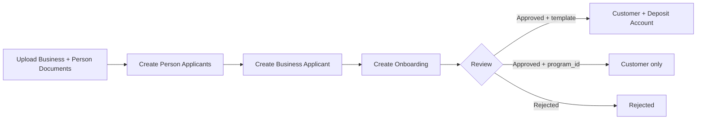

> For a complete page index, fetch https://docs.erebor.bank/llms.txt

# Business onboarding

Onboard a company in four steps: upload documents for the business and its people, create person applicants for those people, create the business applicant, and submit the onboarding for review.



## Associated persons

Every business applicant includes an `associated_persons` array identifying the people involved with the business. Each entry references a person applicant and defines their role.

**Roles**

| Role               | Description                                                                                                                                          |
| ------------------ | ---------------------------------------------------------------------------------------------------------------------------------------------------- |
| `CONTROL_PERSON`   | Individual with significant management responsibility. At least one required.                                                                        |
| `BENEFICIAL_OWNER` | Individual with 25% or more ownership in the entity.                                                                                                 |
| `SIGNER`           | Individual authorized to sign on behalf of the business. At least one required.                                                                      |
| `APPLICANT`        | Individual who submitted the application on behalf of the business. Optional; also appears on applicants onboarded through Erebor-hosted onboarding. |

One person can hold multiple roles. A CEO who owns 60% and signs on behalf of the company would have `roles: ["CONTROL_PERSON", "BENEFICIAL_OWNER", "SIGNER"]`.

If the control person isn't a beneficial owner, include an `authorization_document_id` on the business applicant — a board resolution or power of attorney authorizing them to act on behalf of the business.

## Step 1: Upload documents

Upload documents for both the business and each associated person.

**Business documents:**

* `FORMATION_DOCUMENT` — Articles of incorporation, certificate of formation, or operating agreement
* `IRS_EIN_CONFIRMATION` — IRS EIN confirmation letter (CP 575 or 147C)

**Person documents** (for each associated person):

* `US_DRIVERS_LICENSE` or `PASSPORT`

```bash
curl -X POST "https://api.erebor.bank/documents" \
  -H "Authorization: test_key_YOUR_API_KEY_HERE" \
  -H "Erebor-Idempotency-Key: unique-key-formation-doc" \
  -F "file=@articles_of_incorporation.pdf" \
  -F "document_type=FORMATION_DOCUMENT" \
  -F "name=articles_of_incorporation.pdf" \
  -F "program_id=prgrm_01kasd1tthf1ns1pjn1kncctwd"
```

## Step 2: Create person applicants

Create a person applicant for each control person, beneficial owner, and signer. Follow the same process as [Person Onboarding — Step 2](/onboarding/person-onboarding#step-2-create-person-applicant).

## Step 3: Create business applicant

Create the business applicant, referencing person applicants as associated persons.

```bash
curl -X POST "https://api.erebor.bank/business_applicants" \
  -H "Authorization: test_key_YOUR_API_KEY_HERE" \
  -H "Content-Type: application/json" \
  -H "Erebor-Idempotency-Key: unique-key-business-applicant" \
  -d '{
    "program_id": "prgrm_01kasd1tthf1ns1pjn1kncctwd",
    "name": "Acme Corporation Inc",
    "dba_name": "Acme Corp",
    "legal_entity_type": "CORPORATION",
    "incorporation_address": {
      "street_address": "123 Main Street",
      "city": "Wilmington",
      "country_area": "DE",
      "postal_code": "19801",
      "country": "US"
    },
    "physical_address": {
      "street_address": "456 Market Street",
      "city": "San Francisco",
      "country_area": "CA",
      "postal_code": "94105",
      "country": "US"
    },
    "incorporation_date": "2020-06-30",
    "tin": "987654321",
    "description": "Acme Corporation provides enterprise technology solutions, including cloud infrastructure and software services for businesses worldwide.",
    "industry": "TECHNOLOGY",
    "website_url": "https://www.acme-corp.com",
    "source_of_funds": ["REVENUE", "INVESTMENT"],
    "account_purposes": ["BUSINESS_OPERATIONS", "CROSS_BORDER_PAYMENTS"],
    "primary_target_market": "COMMERCIAL",
    "expected_fiat_monthly_volume": "50K_TO_500K",
    "expected_crypto_monthly_volume": "NONE",
    "formation_document_id": "doc_03kasd1tthf1ns1pjn1kncctwd",
    "tin_verification_document_id": "doc_04kasd1tthf1ns1pjn1kncctwd",
    "associated_persons": [
      {
        "person_applicant_id": "prsn_app_01kasd1tthf1ns1pjn1kncctwd",
        "title": "CEO",
        "roles": ["CONTROL_PERSON", "BENEFICIAL_OWNER", "SIGNER"],
        "ownership_percentage": 60
      },
      {
        "person_applicant_id": "prsn_app_02kasd1tthf1ns1pjn1kncctwd",
        "title": "CTO",
        "roles": ["BENEFICIAL_OWNER"],
        "ownership_percentage": 40
      }
    ]
  }'
```

If the applicant is missing fields your program requires, or a field fails validation (for example, a lowercase or spelled-out US state in `physical_address.country_area` or `incorporation_address.country_area`), the request is rejected with `422` and a `VALIDATION_ERROR` body whose `error_details` array lists every failing field at once.

## Step 4: Create onboarding

Submit the Onboarding with the Business Applicant. Provide **at least one** of `deposit_account_template_id` or `program_id` — see [Onboarding Overview](/onboarding/overview) for when to use each. You can also send both; if the supplied `program_id` does not match the template's program, the request is rejected with `400`.

**With template** (Customer + initial Deposit Account opened on approval):

```bash
curl -X POST "https://api.erebor.bank/onboardings" \
  -H "Authorization: test_key_YOUR_API_KEY_HERE" \
  -H "Content-Type: application/json" \
  -H "Erebor-Idempotency-Key: unique-key-onboarding" \
  -d '{
    "business_applicant_id": "biz_app_01kasd1tthf1ns1pjn1kncctwd",
    "deposit_account_template_id": "dep_acct_tmpl_01kasd1tthf1ns1pjn1kncctwd",
    "disclosures": {
      "disclosures_signed_externally": true
    }
  }'
```

**Program-only** (Customer only on approval — open accounts later):

```bash
curl -X POST "https://api.erebor.bank/onboardings" \
  -H "Authorization: test_key_YOUR_API_KEY_HERE" \
  -H "Content-Type: application/json" \
  -H "Erebor-Idempotency-Key: unique-key-onboarding" \
  -d '{
    "business_applicant_id": "biz_app_01kasd1tthf1ns1pjn1kncctwd",
    "program_id": "prgrm_01kasd1tthf1ns1pjn1kncctwd",
    "disclosures": {
      "disclosures_signed_externally": true
    }
  }'
```

After a program-only Onboarding is approved, open Deposit Accounts for the new Customer by calling [`POST /deposit_accounts`](/api-reference/accounts/deposit-accounts/create-deposit-account) when they're ready to transact.

You must present Erebor's disclosures to your customer and get their acknowledgment before creating the Onboarding. Set `disclosures_signed_externally` to `true` to confirm.

## Next steps

* [Onboarding Overview](/onboarding/overview) — Statuses, approval details, and prerequisites
* [Person Onboarding](/onboarding/person-onboarding) — Onboard individuals
* [Account management](/api-reference/accounts/deposit-accounts/list-deposit-accounts) — Manage deposit accounts after approval