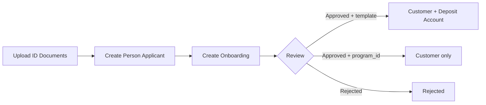

> For a complete page index, fetch https://docs.erebor.bank/llms.txt

# Person onboarding

Onboard an individual in three steps: upload identity documents, create a person applicant, and submit the onboarding for review.



## Step 1: Upload documents

Upload a government-issued ID. Supported types: `US_DRIVERS_LICENSE`, `PASSPORT`, `OTHER`.

```bash
curl -X POST "https://api.erebor.bank/documents" \
  -H "Authorization: test_key_YOUR_API_KEY_HERE" \
  -H "Erebor-Idempotency-Key: unique-key-front-id" \
  -F "file=@drivers_license_front.pdf" \
  -F "document_type=US_DRIVERS_LICENSE" \
  -F "name=drivers_license_front.pdf" \
  -F "program_id=prgrm_01kasd1tthf1ns1pjn1kncctwd"
```

Driver's licenses need both front and back as separate uploads. Passports only need the front.

## Step 2: Create person applicant

Create a person applicant that references the uploaded document IDs.

`person_applicant_type` defaults to `LEGACY` when omitted or set to `null`. Use `RETAIL_CUSTOMER`, `HNWI_CUSTOMER`, or `ASSOCIATED_PERSON` to assign a classification explicitly.

```bash
curl -X POST "https://api.erebor.bank/person_applicants" \
  -H "Authorization: test_key_YOUR_API_KEY_HERE" \
  -H "Content-Type: application/json" \
  -H "Erebor-Idempotency-Key: unique-key-person-applicant" \
  -d '{
    "program_id": "prgrm_01kasd1tthf1ns1pjn1kncctwd",
    "person_applicant_type": "RETAIL_CUSTOMER",
    "first_name": "John",
    "last_name": "Smith",
    "date_of_birth": "1990-05-15",
    "physical_address": {
      "street_address": "123 Main Street",
      "city": "San Francisco",
      "country_area": "CA",
      "postal_code": "94105",
      "country": "US"
    },
    "citizenship": "US",
    "email_address": "john.smith@example.com",
    "phone_number": "4155551234",
    "tin": "123456789",
    "front_identity_document_id": "doc_01kasd1tthf1ns1pjn1kncctwd",
    "back_identity_document_id": "doc_02kasd1tthf1ns1pjn1kncctwd",
    "source_of_wealth": ["INCOME", "INVESTMENT_INCOME"],
    "source_of_funds": ["INCOME", "SAVINGS"],
    "account_purposes": ["PERSONAL_BANKING"],
    "expected_fiat_monthly_volume": "5K_TO_50K",
    "expected_crypto_monthly_volume": "NONE",
    "employment_status": "FULL_TIME",
    "annual_income": {
      "value": "12000000",
      "currency": "USD"
    }
  }'
```

If the applicant is missing fields your program requires, or a field fails validation (for example, a lowercase or spelled-out US state in `physical_address.country_area`), the request is rejected with `422` and a `VALIDATION_ERROR` body whose `error_details` array lists every failing field at once.

## Step 3: Create onboarding

Submit the Onboarding with the Person Applicant. Provide **at least one** of `deposit_account_template_id` or `program_id` — see [Onboarding Overview](/onboarding/overview) for when to use each. You can also send both; if the supplied `program_id` does not match the template's program, the request is rejected with `400`.

**With template** (Customer + initial Deposit Account opened on approval):

```bash
curl -X POST "https://api.erebor.bank/onboardings" \
  -H "Authorization: test_key_YOUR_API_KEY_HERE" \
  -H "Content-Type: application/json" \
  -H "Erebor-Idempotency-Key: unique-key-onboarding" \
  -d '{
    "person_applicant_id": "prsn_app_01kasd1tthf1ns1pjn1kncctwd",
    "deposit_account_template_id": "dep_acct_tmpl_01kasd1tthf1ns1pjn1kncctwd",
    "disclosures": {
      "disclosures_signed_externally": true
    }
  }'
```

**Program-only** (Customer only on approval — open accounts later):

```bash
curl -X POST "https://api.erebor.bank/onboardings" \
  -H "Authorization: test_key_YOUR_API_KEY_HERE" \
  -H "Content-Type: application/json" \
  -H "Erebor-Idempotency-Key: unique-key-onboarding" \
  -d '{
    "person_applicant_id": "prsn_app_01kasd1tthf1ns1pjn1kncctwd",
    "program_id": "prgrm_01kasd1tthf1ns1pjn1kncctwd",
    "disclosures": {
      "disclosures_signed_externally": true
    }
  }'
```

After a program-only Onboarding is approved, open Deposit Accounts for the new Customer by calling [`POST /deposit_accounts`](/api-reference/accounts/deposit-accounts/create-deposit-account) when they're ready to transact.

You must present Erebor's disclosures to your customer and get their acknowledgment before creating the Onboarding. Set `disclosures_signed_externally` to `true` to confirm.

## Next steps

* [Onboarding Overview](/onboarding/overview) — Statuses, approval details, and prerequisites
* [Business Onboarding](/onboarding/business-onboarding) — Onboard companies with control persons and beneficial owners
* [Account management](/api-reference/accounts/deposit-accounts/list-deposit-accounts) — Manage deposit accounts after approval